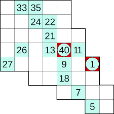

#  Componentes básicas

El Sudoku Hidato es un tablero con varios números ubicados en él y algunas casillas en blanco. El menor
número podrá ser especificado y el mayor estará condicionado con el menor y la cantidad de casillas del tablero, ambos siempre estarán
presentes en el tablero aunque no es necesario que el mayor esté. El objetivo es rellenarlo con números consecutivos que se conectan horizontal, vertical
o diagonalmente, formando así una secuencia de números que están inmediatamente
conectados. Para cada número, su antecesor y su sucesor estará en alguna casilla adyacente con excepción de los extremos.


Se representa el tablero como un tipo compuesto de 3 elementos: una lista compuesta por listas para
representar las casillas, el menor número del tablero y el mayor. Las casillas están representadas con números
enteros.

La definición del tablero es:

``` Haskell
--- Board Definition ---
data Board = Board {
    cells :: [[Int]],
    minNum :: Int,
    maxNum :: Int
} | Empty deriving (Show, Eq)

```


Donde `Empty`
es un valor especial que se usa para representar cuando un tablero es inválido. Aunque pudiese usarse la estructura Maybe de Haskell, se decidió modificar la definición Board con el objetivo de ganar en simplicidad y flexibilidad con los
métodos definidos. Así, por ejemplo un tablero sabe como dibujarse incluso cuando toma el valor de `Empty`.

Asumiendo que los números usados en el juego son naturales mayores que `1` se usa el `0` para representar
las casillas que están vacías. Como un tablero no es necesariamente rectangular se usa además `-1` para
representar las casillas en las que no se pueden poner ningún número. 

Por ejemplo, el tablero de Hidato representado en la siguiente figura:


 se representaría en el código Haskell como:

``` Haskell
sample = Board [
    [0, 33, 35,  0,  0],         
    [0,   0, 24, 22,  0],        
    [0,   0,  0, 21,  0, 0],     
    [0,  26,  0, 13, 40, 11],    
    [27,  0,  0,  0,  9,  0, 1], 
    [-1, -1,  0,  0, 18,  0, 0], 
    [-1, -1, -1, -1,  0,  7, 0, 0],
    [-1, -1, -1, -1, -1, -1, 5, 0]]
    1 40

```

# Resolver un Hidato

Uno de los objetivos principales del proyecto es, teniendo como entrada un Hidato de cualquier forma,
con algunas casillas anotadas y el menor y el mayor número señalados, ejecutar un programa que permitirá
dar solución al tablero.

La función principal para dar solución a un Hidato se llama `solve` y recibe como parámetro un `Board` y
como salida imprime el tablero solucionado.

La estrategia llevada a cabo para la generación de la solución del tablero fue un procedimiento recursivo de backtracking,
que a pesar de poder ser ineficiente garantiza la solución del mismo.


Se tiene el método 
``` Haskell
solveR :: Board -> Int -> (Int, Int)  -> Board
```
que dado un tablero, el último valor puesto y las coordenadas de la casilla en la que se está; esto siempre lo tenemos ya que el menor valor siempre está posicionado en un Hidato. Devuelve un tablero resultado de agregar él numero siguiente en la cadena o `Empty` en caso de resultar un tablero inválido.
La función termina cuando el último valor (máximo) se pone.

Se comienza colocando el menor número, a partir de él se comenzará a generar la secuencia
de números que se posicionarán en el tablero hasta llegar a poner el último. Se llega a la solución cuando el último número puesto coincide con el máximo del tablero o se llegan a condiciones de tablero inválidas.

En caso de que el último valor puesto sea el máximo la recursión termina. De lo contrario se hace:

1- Chequear que el sucesor es un vecino, en tal caso se llama a la función solveR con el valor y la posición del sucesor

2- Si el sucesor no es un vecino pero se encuentra ya puesto en el tablero se devuelve el tablero como inválido. 

3- En caso contrario se trata de ir posicionando el proximo número en una casilla vecina y se llama recursivamente con el tablero actualizado.

# Generar Hidatos

Otro de los objetivos del proyecto es crear un programa en Haskell que genere Hidatos, de varias formas,
que tendrán solución para ser utilizados por el programa del objetivo anterior.

La función principal para generar un Hidato se llama `generate` y recibe como parámetro dos números n
y m que serán las dimensiones del tablero así como un número para el menor valor posible y otro que indique la forma del tablero. Como salida se genera devuelve un `Board`


Este algoritmo se lleva a cabo de manera cuasi-aleatoria.
En un inicio se definen tres formas principales:

- `cloudBoard`, que construye cuadrados cuya arista va disminuyendo desde la esquina superior izquierda
hasta la esquina inferior derecha (se tomó como guía el Hidato brindado en el ejemplo, que sería un
cloudBoard de dimensiones de 8x8)

-`mirrorBoard`, que deja disponibles aquellas casillas que no están en la diagonal principal.

`squareBoard`, que es la forma estándar de un cuadrado o rectángulo.

La posición que toma el primer valor a insertar se toma de forma aleatoria. Se genera un tablero
en blanco (todas las casillas en 0) con las dimensiones deseadas, el número de casillas determina el mayor
valor a colocar en el tablero.
Con estas condiciones comienza el algoritmo para completar el tablero, este recibe un tablero vacío y pone el menor valor, luego usa el método solve para rellenar el tablero recursivamente.

# Funcionamento

Se puede compilar y generar dos ejecutables Solver y Generator.

Solver se le pasa el nombre de un fichero con -f (por defecto busca "board") e imprime la respuesta.

Generator genera un table con los valores deseado.

```
Solver [--version] [--file VALUE]

Available options: 

  -h,--help                Show this help text

  --version                Show version 

  --file VALUE             file with generated hidato (default: "board")
```

``` 
Generator [--version] [-w --width INT] [-h| --height INT] 
                 [-m| --minvalue INT] [-t --template INT] [-f| --file VALUE]

Available options:
  -h,--help                Show this help text
  --version                Show version
  -w,--width INT           Board width (default: 4)
  -h,--height INT          Board height (default: 4)
  -m,--minvalue INT        Minimal value of a cell in the board (default: 1)
  -t,--template INT        0: cloud 1: mirror 2: square (default: 0)
  -f,--file VALUE          File to save (default: "board.txt")

```